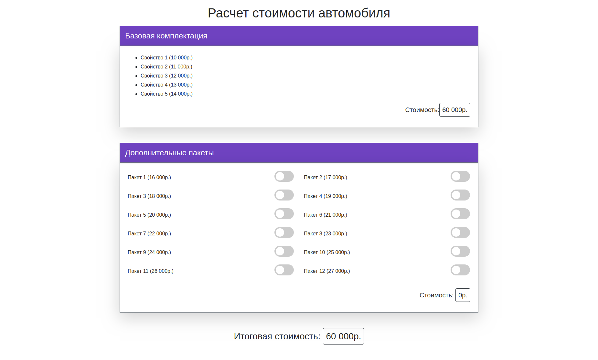
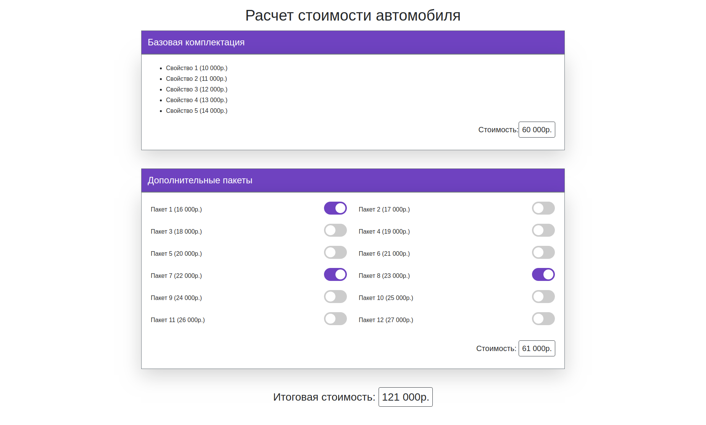

# Тестовое задание на должность Frontend разработчика

Разработайте страницу калькулятора, согласно макету.

## Верстка
Необходимо схематично (необязательно точно выдерживать размеры) сверстать страницу калькулятора.

Будет плюсом использование:
- Bootstrap CSS
- SCSS или SASS

## Калькулятор
Логика калькулятора должна быть реализована на фреймворке Vue.js.
- Базовая комплектация - фиксировання цена.
- Каждый дополнительный пакет прибавляется к общей стоимости и к сумме за все дополнительные пакеты.
- При выборе любого из пакетов, суммы должны пересчитываться.

Пример макета с выбранными дополнительными опциями:

## Результат
Реализованный проект прислать архивом или ссылкой на GitHub репозиторий на почту [a.kolesnik@simdev.ru](mailto:a.kolesnik@simdev.ru)
